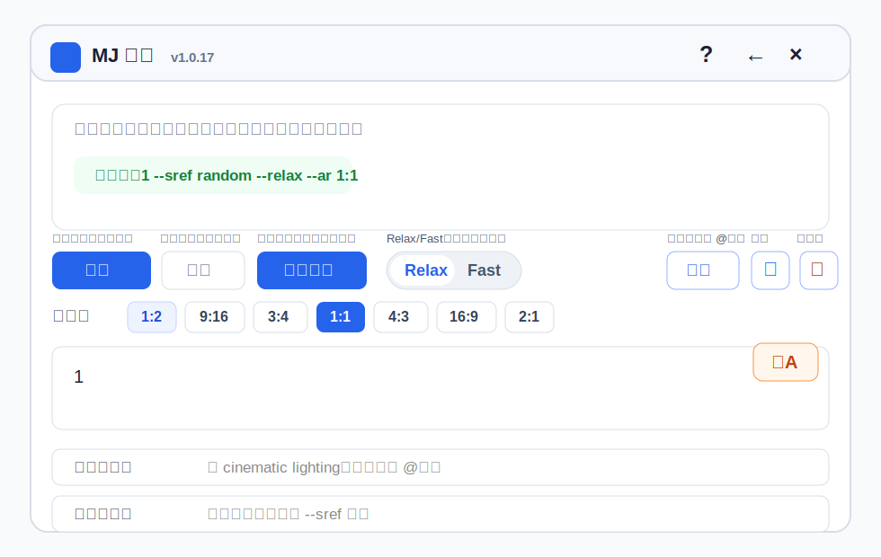
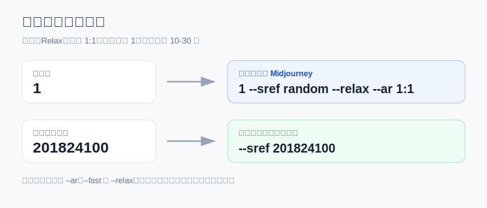
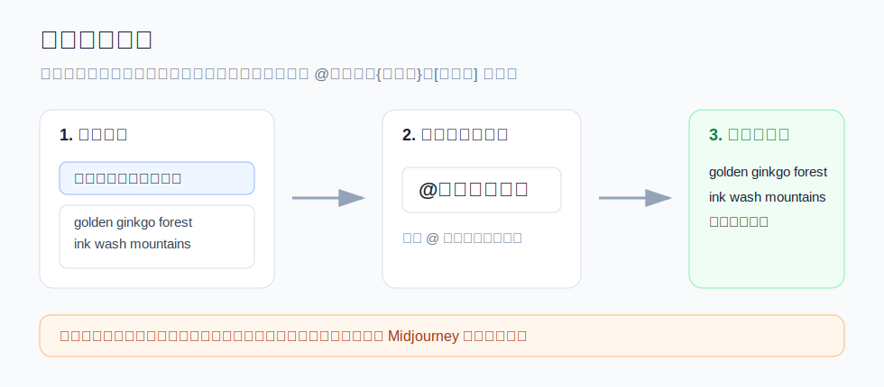

# MJ 灵帆

MJ 灵帆是一个本地轻量浏览器扩展，用于 Midjourney 网页端文生图：批量排队、变量展开、定时发送、翻译提示词和下载图片。

- 支持 Microsoft Edge / Google Chrome
- Manifest V3
- 无需构建，直接加载项目目录
- 所有数据保存在浏览器本地

## 安装

1. 打开 `edge://extensions/` 或 `chrome://extensions/`
2. 打开“开发人员模式”
3. 点击“加载解压缩的扩展”
4. 选择本项目目录
5. 打开或刷新 `https://www.midjourney.com/imagine`

更新扩展后，也需要刷新一次 Midjourney 页面。

## 面板总览



面板分三层：

| 区域 | 用途 |
| --- | --- |
| 日志区 | 查看准备发送、已发送、失败原因 |
| 控制区 | 开始、暂停、加入队列、速度、重复次数、发送间隔 |
| 输入区 | 提示词、尺寸、变量、翻译、前缀、后缀 |

## 1 分钟上手

1. 在“提示词”输入内容，每行一个任务。
2. 选择尺寸，例如 `1:1`、`9:16`、`16:9`。
3. 选择速度，默认 `Relax`，需要快速生成时切到 `Fast`。
4. 设置重复次数和发送间隔，默认随机等待 `10-30 秒`。
5. 点击“加入队列”只保存任务；点击“开始”会加入并开始发送。

## 默认设置

| 项目 | 默认值 | 实际效果 |
| --- | --- | --- |
| 发送模式 | `Relax` | 追加 `--relax` |
| 图片尺寸 | `1:1` | 追加 `--ar 1:1` |
| 重复次数 | `1` | 每条提示词生成 1 个任务 |
| 发送间隔 | `10-30 秒` | 每次发送后随机等待 |
| 队列上限 | `500 条` | 防止变量展开过多导致卡顿 |
| 自动下载 | 关闭 | 开启后尝试保存新生成图片 |

## 默认命令规则



### 示例 1：只输入数字

输入：

```text
1
```

发送：

```text
1 --sref random --relax --ar 1:1
```

### 示例 2：普通提示词

输入：

```text
sacred snowy mountain
```

选择 `9:16` 后发送：

```text
sacred snowy mountain --relax --ar 9:16
```

### 示例 3：后缀输入数字

提示词：

```text
masked assassin
```

提示词后缀：

```text
201824100
```

发送：

```text
masked assassin --sref 201824100 --relax --ar 1:1
```

插件不会在 Midjourney 参数之间加逗号，避免出现无效命令。

## 按钮说明

### 顶部

| 按钮 | 作用 |
| --- | --- |
| `?` | 打开使用说明 |
| `← / →` | 把面板切换到浏览器左侧或右侧 |
| `×` | 收起成侧边小图标 |

### 发送控制

| 按钮/控件 | 作用 |
| --- | --- |
| `开始` | 开始发送队列；如果队列为空，会先加入当前提示词 |
| `暂停` | 暂停后续发送，不清空队列 |
| `加入队列` | 只添加任务，不立即发送 |
| `Relax` | 慢速模式，追加 `--relax` |
| `Fast` | 快速模式，追加 `--fast` |
| `自动下载` | 尝试自动保存新出现的图片 |
| `重复次数` | 每条提示词重复加入几次 |
| `间隔` | 两次发送之间随机等待 |

### 工具

| 按钮 | 作用 |
| --- | --- |
| `变量` | 管理预设词，可用 `@变量名` 调用 |
| `↻` | 恢复默认输入和参数 |
| `🧹` | 清空日志，不影响任务 |
| `文A` | 把中文提示词翻译成英文 |

### 队列

| 按钮 | 作用 |
| --- | --- |
| `复制队列` | 复制队列里的提示词 |
| `导出提示词` | 导出纯提示词 `.txt` |
| `导出完整队列` | 导出包含状态的 `.json` |
| `清空` | 清空队列和运行状态 |
| `下载可见图片` | 下载当前页面可见图片 |
| `重试失败` | 把失败任务重新设为待发送 |
| `清理已完成` | 删除已发送任务 |
| `↑ / ↓` | 调整单个任务顺序 |
| `↻` | 重试单个任务 |
| `×` | 删除单个任务 |

## 变量用法



变量适合保存常用场景、人物、风格和参数。变量值建议用英文，每行一个。

示例变量：

```text
东方自然风景
golden ginkgo forest
ink wash mountains
eastern sea of clouds
```

在提示词中输入：

```text
@东方自然风景
```

会展开为多条任务：

```text
golden ginkgo forest --relax --ar 1:1
ink wash mountains --relax --ar 1:1
eastern sea of clouds --relax --ar 1:1
```

支持三种调用方式：

```text
@东方自然风景
{东方自然风景}
[东方自然风景]
```

## 翻译

`文A` 会把当前中文提示词翻译成英文，并回填到提示词输入框。

注意：

- 只翻译提示词，不修改尺寸、速度、前缀和后缀。
- 翻译依赖第三方免费接口 `api.mymemory.translated.net`。
- 接口失败时会保留原文，并提示稍后重试。

## 下载图片

鼠标移到 Midjourney 生成图上，会出现下载按钮。

| 按钮 | 作用 |
| --- | --- |
| `下载` | 下载单张图片 |
| `下载全部` | 下载四宫格或同组图片 |

下载位置由浏览器决定，通常是 Edge/Chrome 的默认下载文件夹。

## 使用建议

- 长队列发送时，建议单独开一个浏览器窗口放 Midjourney。
- 不要最小化 Midjourney 窗口，避免页面休眠。
- 失败后插件会继续执行剩余任务，失败项可以单独重试。
- 更新扩展后，如果版本没变化，先刷新扩展，再刷新 Midjourney 页面。

## 权限说明

| 权限 | 用途 |
| --- | --- |
| `storage` | 保存队列、变量、面板位置和用户设置 |
| `alarms` | 让发送间隔在浏览器后台更稳定计时 |
| `downloads` | 下载图片和导出文件 |
| `midjourney.com` | 在 Midjourney 页面注入助手面板 |
| `api.mymemory.translated.net` | 调用免费翻译接口 |

## 开发检查

```bash
node --check content.js
node --check background.js
node -e "JSON.parse(require('fs').readFileSync('manifest.json', 'utf8'))"
```
